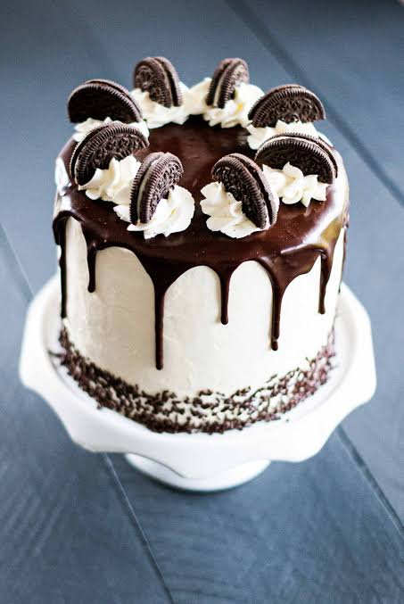

# ST10172088_WEDEPART2_SWEETCRUMBSBAKERY
# SANELE DLAMINI
# Sweet Crumbs Bakery — Website Project 2026

## Student Web Development Project — Part 2

Sweet Crumbs Bakery is a responsive multi-page bakery website developed using HTML5, CSS3 and JavaScript. The website provides customers with information about the bakery, allows them to browse a cake menu and gallery, interact with an ordering system, and proceed to a checkout/payment interface.

This project was developed as part of the Web Development Part 2 requirements, with a focus on CSS styling, responsive web design, usability, accessibility, interactive functionality and documentation.

---

# Table of Contents

1. [Project Overview](#1-project-overview)
2. [Website Goals and Objectives](#2-website-goals-and-objectives)
3. [Learning Outcomes Addressed](#3-learning-outcomes-addressed)
4. [Website Structure](#4-website-structure)
5. [Key Features and Functionality](#5-key-features-and-functionality)
6. [CSS Styling and Design](#6-css-styling-and-design)
7. [Responsive Design](#7-responsive-design)
8. [Typography](#8-typography)
9. [Layout Structure](#9-layout-structure)
10. [Visual Design](#10-visual-design)
11. [JavaScript Functionality](#11-javascript-functionality)
12. [Gallery Improvements](#12-gallery-improvements)
13. [Accessibility](#13-accessibility)
14. [Testing](#14-testing)
15. [Browser and Device Testing](#15-browser-and-device-testing)
16. [Part 1 Feedback and Changelog](#16-part-1-feedback-and-changelog)
17. [Project File Structure](#17-project-file-structure)
18. [How to Run the Website](#18-how-to-run-the-website)
19. [GitHub Repository](#19-github-repository)
20. [Timeline and Milestones](#20-timeline-and-milestones)
21. [Future Improvements](#21-future-improvements)
21.9 screenshots
22. [Conclusion](#22-conclusion)
23. [References](#23-references)

---

# 1. Project Overview

**Sweet Crumbs Bakery** is a fictional bakery website designed to provide customers with a professional and user-friendly online experience.

The website was developed to showcase bakery products, provide business information and demonstrate an interactive front-end ordering process.

The project consists of several interconnected pages:

- Home
- Menu
- Gallery
- About
- Contact
- Payment / Checkout

The website uses a consistent visual identity across the pages, including a warm bakery-inspired colour scheme, reusable components, responsive layouts, buttons, cards, navigation elements and interactive features.

### Technologies Used

| Technology | Purpose |
|---|---|
| HTML5 | Page structure and semantic content |
| CSS3 | Styling, layout and responsive design |
| JavaScript | Interactive functionality |
| CSS Grid | Responsive content and gallery layouts |
| Flexbox | Navigation and component alignment |
| LocalStorage | Passing cart information to the checkout page |
| GitHub | Version control and repository management |
| Visual Studio Code | Development environment |
| Live Server | Local website testing |

---

# 2. Website Goals and Objectives

## 2.1 Main Goal

The main goal of the project is to create a professional, attractive and responsive bakery website that allows visitors to learn about Sweet Crumbs Bakery, browse products and interact with an online ordering system.

## 2.2 Website Objectives

The objectives of the website are to:

- Create a professional online presence for Sweet Crumbs Bakery.
- Provide clear information about the bakery.
- Display available cake products.
- Create an attractive product gallery.
- Allow customers to select products and quantities.
- Provide a working front-end shopping cart.
- Calculate order totals dynamically.
- Provide a checkout/payment interface.
- Maintain consistent navigation across all pages.
- Apply external CSS styling.
- Implement responsive layouts for desktop, tablet and mobile devices.
- Use modern CSS techniques including Grid and Flexbox.
- Improve accessibility through semantic HTML, labels and alternative text.
- Test the website at different screen sizes.
- Document changes made during Part 2.

---

# 3. Learning Outcomes Addressed

This project addresses the Part 2 learning outcomes by demonstrating the following:

### External CSS

An external stylesheet is used to control the appearance and layout of the website.

The project includes:

- `style.css`
- `shared-theme.css`

These stylesheets allow common styles to be reused instead of repeating large amounts of CSS across individual HTML pages.

### CSS Selectors

Different CSS selectors are used to target:

- HTML elements
- Classes
- IDs
- Navigation elements
- Buttons
- Cards
- Images
- Forms
- Pseudo-classes

Examples include:

```css
body {
    font-family: Arial, sans-serif;
}

.gallery-item {
    border-radius: 12px;
}

.gallery-item:hover {
    transform: scale(1.05);
}
Typography

CSS typography properties are used to control:

Font family
Font size
Font weight
Line height
Letter spacing
Heading hierarchy
Layout

The website uses:

CSS Grid
Flexbox
Relative units
Maximum widths
Flexible containers
Media queries
Responsive Design

Responsive CSS is used to allow the website to adapt to:

Desktop screens
Tablet screens
Mobile phones

Media queries allow different styling rules to be applied according to the available viewport width.

Developer Tools

Browser developer tools were used during development to inspect:

Page layout
CSS properties
Responsive screen sizes
Navigation
Images
Spacing
Element sizing
Mobile layouts
4. Website Structure
4.1 Home Page — index.html

The home page acts as the main landing page for the website.

It introduces Sweet Crumbs Bakery and provides visitors with access to the main sections of the website.

The home page includes:

Bakery branding
Main navigation
Hero section
Bakery introduction
Featured content
Calls to action
Footer
4.2 Menu Page — menu.html

The menu page provides the main product ordering functionality.

It includes:

Cake selection
Product prices
Quantity selection
Add-to-cart functionality
Cart display
Individual item removal
Dynamic total calculation
Checkout button

The ordering interface is implemented using JavaScript.

4.3 Gallery Page — gallery.html

The gallery page provides a visual display of bakery products.

The gallery contains 11 cake entries:

Chocolate Fudge Cake
Red Velvet Cake
Carrot Cake
Vanilla Buttercream Cake
Black Forest Cake
Lemon Drizzle Cake
Coconut Cream Cake
Tiramisu Cake
Classic Cheesecake
Oreo Cake
Nutella Hazelnut Cake

The gallery uses CSS Grid to create a flexible layout.

The number of columns automatically adjusts according to the available screen width.

4.4 About Page — about.html

The About page provides information about Sweet Crumbs Bakery.

It contains information relating to:

The bakery
Its background
Products and services
Business information
Contact information

The page uses reusable cards and a consistent visual design.

4.5 Contact Page — contact.html

The Contact page provides visitors with a method of contacting the bakery.

The page includes:

Contact form
Contact information
Form labels
Input fields
Submit functionality

JavaScript is used to handle the front-end form submission behaviour.

4.6 Payment Page — payment.html

The payment page provides the checkout interface.

The page receives cart information through browser storage and displays:

Ordered products
Quantities
Subtotals
Total order value
Customer information fields
Delivery information
Payment options

The current payment implementation is a front-end demonstration and does not process real financial transactions.

5. Key Features and Functionality
5.1 Consistent Navigation

A consistent navigation system is provided across the website.

Users can access:

Home
Menu
Gallery
About
Contact
Order

The navigation styling is shared across pages to provide a consistent user experience.

5.2 Responsive Gallery

The gallery uses CSS Grid.

Example:

.gallery-container {
    display: grid;
    grid-template-columns: repeat(auto-fit, minmax(250px, 1fr));
    gap: 20px;
}

This allows the number of columns to change according to the available screen width.

The responsive approach follows modern CSS layout principles where flexible grids can adapt to different viewport sizes.

5.3 Product Cards

The gallery and menu use card-based layouts.

Product cards contain:

Product image
Product name
Product description
Product information
Action buttons

Cards use borders, shadows, spacing and hover effects to make products visually distinct.

5.4 Shopping Cart

The menu page contains a JavaScript-powered shopping cart.

Users can:

Select a product.
Select a quantity.
Add the product to the cart.
View the cart.
Remove products.
View the calculated total.
Continue to checkout.

The cart calculates each item's subtotal using:

Product price × Quantity

The final cart total is calculated from all products currently in the cart.

5.5 Dynamic Cart Calculation

JavaScript is used to calculate order totals dynamically.

For example:

const subtotal = item.price * item.quantity;

The total is then updated whenever an item is added or removed.

5.6 Cart Data and LocalStorage

The website uses browser localStorage to transfer cart information to the payment page.

The cart information can be retrieved using:

const cartItems =
    JSON.parse(localStorage.getItem("cartItems")) || [];

This allows the checkout page to display the products selected by the customer.

localStorage is suitable for demonstrating client-side storage but should not be used as a secure database for sensitive customer or payment information.

5.7 Interactive Buttons

Buttons are styled consistently throughout the website.

Hover states are used to provide visual feedback.

For example:

button:hover {
    filter: brightness(1.08);
}

Interactive states help users understand which elements are clickable.

6. CSS Styling and Design
6.1 External Stylesheets

The project uses external CSS files rather than placing all styling directly inside individual HTML pages.

The main stylesheets are:

style.css
shared-theme.css

This improves maintainability and allows common styling rules to be reused.

6.2 CSS Reset

A CSS reset is used to reduce differences between browser default styles.

Example:

* {
    margin: 0;
    padding: 0;
    box-sizing: border-box;
}

The box-sizing property makes width and height calculations more predictable.

6.3 CSS Variables

Reusable CSS variables are defined to maintain the site's visual identity.

Examples include:

:root {
    --primary-yellow: #FFD700;
    --gold: #D4AF37;
    --cream: #FFF8DC;
    --dark-brown: #5D4037;
    --white: #FFFFFF;
    --black: #000000;
}

CSS variables make it easier to update the colour scheme without changing individual rules throughout the stylesheet.

6.4 Colour Scheme

The website uses a warm bakery-inspired colour palette.

Colour	Purpose
Gold	Brand accent and calls to action
Yellow	Highlights and buttons
Brown	Headings and bakery branding
Cream	Background and supporting surfaces
White	Product cards and content sections
Black / Dark Brown	Navigation and footer elements

The colour scheme is intended to create a warm and welcoming bakery aesthetic.

7. Responsive Design

Responsive design is one of the main requirements of Part 2.

The website is designed to adapt to different viewport sizes rather than relying on a fixed desktop layout.

Modern responsive design commonly uses flexible layouts, relative units, media queries, CSS Grid and Flexbox.

7.1 Desktop Layout

On larger screens:

Content can use multiple columns.
Gallery cards have more available horizontal space.
Navigation has more room.
Product cards can be displayed side-by-side.
Content containers have larger maximum widths.
7.2 Tablet Layout

On tablet-sized screens:

Content columns become narrower.
Gallery items resize.
Navigation elements wrap when required.
Images scale to the available width.
Spacing is reduced where necessary.
7.3 Mobile Layout

On smaller screens:

Content changes towards a single-column layout.
Navigation becomes vertically arranged where required.
Product cards become narrower.
Gallery images scale to fit the viewport.
Font sizes are reduced where appropriate.
Form elements expand to available width.

Media queries are used to apply different styles at smaller viewport sizes. CSS media queries allow styles to be conditionally applied according to viewport and device characteristics.

Example:

@media (max-width: 720px) {
    header#home h1 {
        font-size: 1.8rem;
    }

    .menu-card .imgwrap {
        height: 140px;
    }

    .gallery-item img {
        height: 120px;
    }
}
8. Typography

Typography is used to create a clear hierarchy between different levels of information.

The project uses different typography treatments for:

Main headings
Section headings
Product names
Paragraph text
Navigation links
Buttons

Examples of CSS typography properties used include:

font-family
font-size
font-weight
line-height
letter-spacing

Headings use a stronger visual treatment while paragraph text is kept readable.

Relative units such as rem are used in several areas so that text and spacing can scale more naturally.

9. Layout Structure
9.1 CSS Grid

CSS Grid is used extensively for the gallery and product layouts.

Example:

.menu-grid {
    display: grid;
    grid-template-columns:
        repeat(auto-fit, minmax(240px, 1fr));
    gap: 1rem;
}

CSS Grid is a two-dimensional layout system that is well suited to arranging content in rows and columns.

9.2 Flexbox

Flexbox is used for areas where content needs to be aligned horizontally or vertically.

Examples include:

Navigation
Buttons
Card content
Header elements
Form components

Example:

nav .nav-inner {
    display: flex;
    align-items: center;
    justify-content: space-between;
}

Flexbox allows elements to grow, shrink and distribute available space according to the size of their container.

9.3 Relative Units

The project uses relative units such as:

%
rem
em
fr

These units help layouts adapt to different screen sizes.

10. Visual Design

The website uses several CSS visual effects.

10.1 Cards

Cards use:

White backgrounds
Rounded corners
Borders
Shadows
Padding
Hover effects

Example:

.gallery-item {
    border-radius: 12px;
    overflow: hidden;
    box-shadow: 0 4px 12px rgba(0,0,0,0.2);
}
10.2 Hover Effects

Gallery items use hover effects to provide visual feedback.

Example:

.gallery-item:hover {
    transform: scale(1.05);
}

The effect makes the interface more interactive when users move their pointer over a product.

10.3 Buttons

Buttons use:

Rounded corners
Background colours
Padding
Font weight
Hover effects
Transitions

The consistent button design helps users recognise interactive elements throughout the website.

11. JavaScript Functionality

JavaScript is used to provide interactive behaviour.

11.1 Mobile Navigation

JavaScript is used on applicable pages to toggle the mobile navigation.

The navigation can be opened and closed depending on the screen layout.

11.2 Contact Form

The contact form uses JavaScript to handle the front-end submission interaction.

The current implementation displays a confirmation message and resets the form.

This is a demonstration feature and is not connected to a real email server or backend.

11.3 Shopping Cart

The shopping cart allows users to:

Add products
Specify quantities
Increase quantities for existing products
Remove products
Calculate totals
Proceed to checkout
11.4 Checkout

The payment page reads cart information from localStorage.

It then calculates and displays the order total.

This demonstrates communication between different pages using browser-side storage.

12. Gallery Improvements

An important Part 2 improvement was completing the missing gallery images.

Images Added

The following image files were added:

images/oreo-cake.jpg
images/nutella-hazelnut-cake.jpg

These images are now used by the corresponding gallery products.

Oreo Cake

The Oreo Cake gallery card was updated so that it uses the supplied local JPG image.

Nutella Hazelnut Cake

The Nutella Hazelnut Cake gallery card was updated so that it uses the supplied local JPG image.

This ensures that the gallery contains complete visual content rather than missing or placeholder imagery.

13. Accessibility

Accessibility was considered during the development of the website.

The project includes several accessibility-oriented practices.

13.1 Alternative Text

Product images use alternative text where appropriate.

Example:



Alternative text helps communicate the purpose or content of images to users who cannot see them.

13.2 Form Labels

Forms use labels to identify input controls.

Example:

<label for="quantity">Quantity</label>
<input
    type="number"
    id="quantity"
    name="quantity">
13.3 Semantic HTML

Semantic elements are used where appropriate, including:

<header>
<nav>
<main>
<section>
<article>
<footer>

This helps provide a meaningful structure for browsers and assistive technologies.

13.4 Keyboard Interaction

Standard HTML links, buttons and form controls are used to support normal keyboard interaction.

Accessibility should continue to be tested against the applicable WCAG success criteria before treating the website as fully conformant.

14. Testing

Testing was performed to check the functionality, appearance and responsiveness of the website.

14.1 Navigation Testing

The following navigation links were checked:

Link	Expected Result
Home	Opens index.html
Menu	Opens menu.html
Gallery	Opens gallery.html
About	Opens about.html
Contact	Opens contact.html
Order	Opens the ordering section
Checkout	Opens payment.html when applicable
14.2 Gallery Testing

The gallery was checked to confirm:

All product cards appear.
Images load correctly.
Oreo Cake image loads correctly.
Nutella Hazelnut Cake image loads correctly.
Images remain within their containers.
Gallery cards resize correctly.
Hover effects function on pointer-based devices.
The gallery adapts to smaller screens.
14.3 Shopping Cart Testing

The following functionality was tested:

Product selection
Quantity selection
Adding an item
Adding the same item more than once
Removing an item
Calculating subtotals
Calculating the total
Opening checkout
14.4 Form Testing

Forms were checked for:

Correct labels
Input fields
Required information
Appropriate controls
Successful front-end submission behaviour
15. Browser and Device Testing

The website should be tested using browser developer tools and physical devices where available.

Desktop

Tested using a desktop browser at large viewport sizes.

Areas checked:

Navigation
Page width
Gallery columns
Menu cards
Forms
Footer
Buttons
Tablet

The layout was checked at tablet-sized viewport widths.

Areas checked:

Navigation wrapping
Gallery columns
Card sizing
Text readability
Image scaling
Mobile

The layout was checked at mobile-sized viewport widths.

Areas checked:

Single-column layout
Navigation
Gallery
Product cards
Forms
Buttons
Text size
Horizontal overflow

Responsive design guidance recommends testing layouts at different viewport sizes rather than designing for only one fixed device size.

16. Part 1 Feedback and Changelog

All significant changes made after Part 1 have been documented below.

Version 1.0 — Initial Part 1 Website

The original project established:

HTML page structure
Basic navigation
Bakery content
Menu
Gallery
Contact page
About page
Checkout/payment page
Version 2.0 — Part 2 CSS and Responsive Improvements
External CSS

External stylesheets were implemented to improve code organisation and maintainability.

The project uses:

style.css
shared-theme.css
Consistent Styling

The visual appearance of the pages was made more consistent.

Changes included:

Consistent colours
Consistent navigation
Consistent buttons
Consistent cards
Consistent spacing
Consistent typography
Responsive Design

Responsive CSS was added and improved.

Changes included:

Flexible Grid layouts
Flexbox layouts
Mobile breakpoints
Relative units
Responsive images
Mobile navigation adjustments
Smaller mobile typography
Gallery Improvements

The missing gallery images were added.

Added files:

images/oreo-cake.jpg
images/nutella-hazelnut-cake.jpg

The gallery HTML was updated so these images are displayed correctly.

Navigation Improvements

Navigation styling was standardised across the website.

This prevents individual pages from having significantly different navigation designs.

Visual Improvements

Additional visual effects were implemented, including:

Card shadows
Rounded corners
Hover effects
Button transitions
Product image scaling
Improved spacing
Documentation

The README was updated to document:

Project objectives
Technical implementation
Responsive design
Testing
Changelog
Gallery improvements
References
17. Project File Structure

The main project structure is:

SweetCrumbsBakery-2026-Gallery-Updated/
│
├── index.html
├── about.html
├── contact.html
├── gallery.html
├── menu.html
├── payment.html
│
├── style.css
├── shared-theme.css
│
├── README.md
│
└── images/
    ├── nutella-hazelnut-cake.jpg
    ├── nutella-hazelnut-cake.svg
    ├── oreo-cake.jpg
    └── oreo-cake.svg
18. How to Run the Website
Method 1 — Open Directly
Download or clone the project.
Extract the project folder.
Open the folder.
Open index.html.
Navigate through the website.
Method 2 — Visual Studio Code + Live Server

The recommended development method is to use Visual Studio Code with Live Server.

Steps
Download or clone the repository.
Open Visual Studio Code.
Select:
File → Open Folder
Select the Sweet Crumbs Bakery project folder.
Open index.html.
Right-click the file.
Select:
Open with Live Server
The website should open in the default browser.

Live Server allows the website to be tested as a local web project and makes it easier to check navigation and responsive layouts.

19. GitHub Repository

The project is intended to be maintained using GitHub for version control and submission.

Recommended Git workflow

After making changes:

git add .
git commit -m "Update responsive CSS and gallery images"
git push

Commit messages should clearly describe the changes made.

Examples:

Update gallery images
Improve responsive navigation
Fix mobile layout
Update checkout functionality
Update README documentation

The final GitHub repository link should be submitted through the required Learning Management System.

Repository Link

Replace the placeholder below with the actual GitHub repository URL:

https://github.com/YOUR-USERNAME/SweetCrumbsBakery-2026
20. Timeline and Milestones
Phase	Milestone	Status
Phase 1	Project planning and requirements analysis	Completed
Phase 2	HTML page structure and navigation	Completed
Phase 3	Basic website content	Completed
Phase 4	External CSS implementation	Completed
Phase 5	Desktop visual styling	Completed
Phase 6	Responsive design implementation	Completed
Phase 7	Menu and shopping cart functionality	Completed
Phase 8	Gallery development	Completed
Phase 9	Missing gallery images added	Completed
Phase 10	Checkout/payment interface	Completed
Phase 11	Accessibility improvements	Completed
Phase 12	Responsive and browser testing	Completed / Ongoing
Phase 13	README and changelog documentation	Completed
Phase 14	Final GitHub submission	Final stage
21. Future Improvements

Although the current website demonstrates the required front-end functionality, several improvements could be made in a future version.

21.1 Backend

A backend system could be added to provide:

Customer accounts
Secure authentication
Order management
Customer order history
Admin dashboard
Product management
Inventory management
21.2 Database

A database could store:

Customer information
Products
Prices
Orders
Delivery information
Inventory
Order status
21.3 Real Payment Gateway

The current payment functionality is a front-end demonstration.

A production website would require a secure payment provider and server-side processing.

Sensitive payment information should not be stored in browser localStorage or plain client-side JavaScript.

21.4 Improved Image Optimisation

Future versions could use:

WebP images
AVIF images
Responsive image sizes
srcset
sizes
Lazy loading
Image compression

Responsive image techniques such as srcset, sizes and the <picture> element can allow appropriate image resources to be selected for different display conditions.

21.5 Search Engine Optimisation

Future improvements could include:

Unique meta descriptions
Improved page titles
Open Graph metadata
Structured data
Bakery business schema
Sitemap
Robots.txt
Local SEO
Search-friendly product descriptions
21.6 Accessibility Audit

A formal accessibility audit could be conducted using the applicable WCAG success criteria.

Potential improvements could include:

More comprehensive keyboard testing
Focus-state improvements
Colour contrast verification
Screen-reader testing
Improved form error messages
Accessibility testing across browsers

22.7 screenshots


22. Conclusion

The Sweet Crumbs Bakery website demonstrates the development of a responsive multi-page website using HTML5, CSS3 and JavaScript.

The Part 2 development focused particularly on:

External CSS
Consistent visual styling
Typography
CSS Grid
Flexbox
Responsive layouts
Media queries
Relative units
Interactive elements
Gallery improvements
Accessibility
Testing
GitHub documentation

The completed website provides a structured bakery experience where visitors can learn about the business, browse products, view a product gallery, interact with an ordering system and proceed to a checkout interface.

The project also provides a foundation for future development into a fully functional production bakery e-commerce website.

23. References

The following sources were consulted for web development, CSS, responsive design, accessibility and browser technologies.

Harvard-Style References
1. Mozilla Developer Network — Responsive Web Design

Mozilla Developer Network (MDN) (2026) Responsive web design. Available at: https://developer.mozilla.org/en-US/docs/Learn_web_development/Core/CSS_layout/Responsive_Design (Accessed: 18 September 2026).

2. Mozilla Developer Network — Media Queries

Mozilla Developer Network (MDN) (2026) CSS media queries. Available at: https://developer.mozilla.org/en-US/docs/Web/CSS/Guides/Media_queries (Accessed: 18 September 2026).

3. Mozilla Developer Network — CSS Grid

Mozilla Developer Network (MDN) (2026) CSS Grid layout. Available at: https://developer.mozilla.org/en-US/docs/Web/CSS/Guides/Grid_layout (Accessed: 9 September 2026).

4. Mozilla Developer Network — CSS Layout

Mozilla Developer Network (MDN) (2026) CSS layout. Available at: https://developer.mozilla.org/en-US/docs/Learn_web_development/Core/CSS_layout (Accessed: 11 September 2026).

5. Mozilla Developer Network — Local Storage

Mozilla Developer Network (MDN) (2026) Window: localStorage property. Available at: https://developer.mozilla.org/en-US/docs/Web/API/Window/localStorage (Accessed: 9 September 2026).

6. Mozilla Developer Network — HTML

Mozilla Developer Network (MDN) (2026) HTML: HyperText Markup Language. Available at: https://developer.mozilla.org/en-US/docs/Web/HTML (Accessed: 18 September 2026).

7. World Wide Web Consortium — WCAG

World Wide Web Consortium (W3C) (2026) Web Content Accessibility Guidelines (WCAG) overview. Available at: https://www.w3.org/WAI/standards-guidelines/wcag/ (Accessed: 17 September 2026).

8. World Wide Web Consortium — Web Accessibility

World Wide Web Consortium (W3C) (2026) Introduction to web accessibility. Available at: https://www.w3.org/WAI/fundamentals/accessibility-intro/ (Accessed: 14 September 2026).

9. Marcotte, E. — Responsive Web Design

Marcotte, E. (2010) Responsive web design. A List Apart. Available at: https://alistapart.com/article/responsive-web-design/ (Accessed: 18 September 2026).
